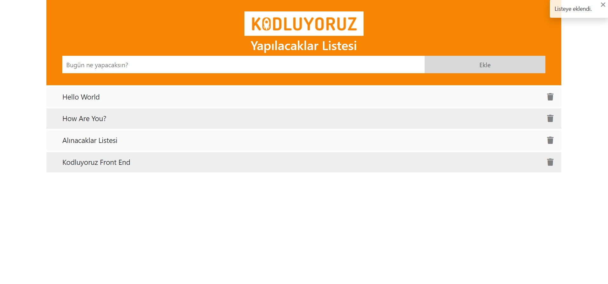
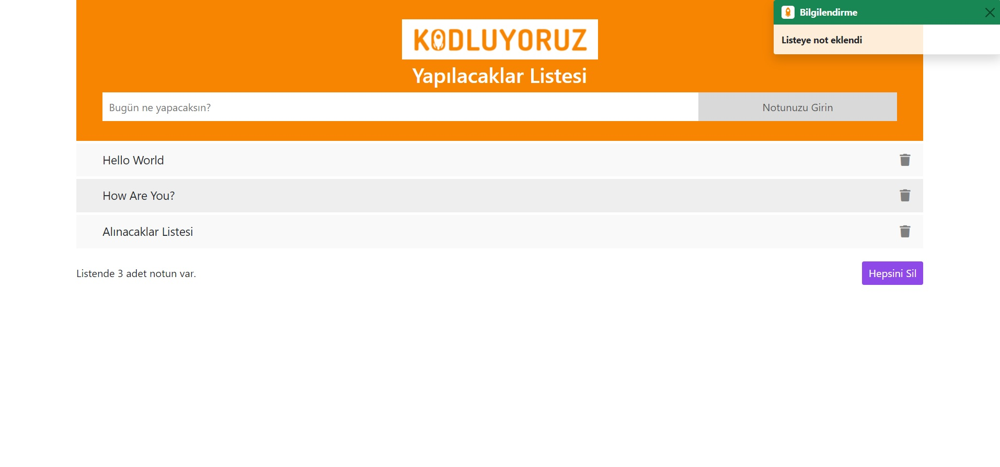

# Kodluyoruz - JavaScript Ödev 2
## Javascript ile To Do List

### Tasarım Görseli - [Kodluyoruz Todo](https://aybarsumur.github.io/kodluyoruz-todoList/)



### Tasarım Görseli - [My Todo](https://aybarsumur.github.io/kodluyoruz-todoList/)



## About Project
Bu repo, [Kodluyoruz](https://kodluyoruz.org) Front-End Eğitiminde oluşturduğum ikinci javascript ödevim.

Projemde iki farklı proje oluşturdum. Ufak farklılıklar var araların. Biri kodluyoruzun verdiği şablon, diğeri ise o şablon üzerine benim eklediğin özellikler ona versiyon.

## Installation
Projeyi klonlayarak kullanabilirsiniz. 
```
https://github.com/aybarsumur/kodluyoruz-todoList.git
```